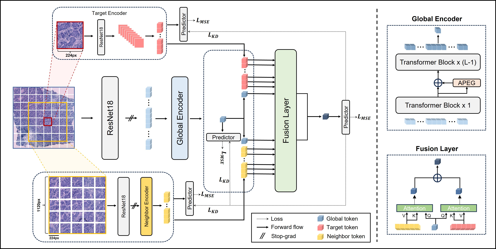

# Accurate Spatial Gene Expression Prediction by integrating Multi-resolution features 

> Accurate Spatial Gene Expression Prediction by integrating Multi-resolution features (accepted in CVPR 2024) \
Youngmin Chung, Ji Hun Ha, Kyeong Chan Im, Joo Sang Lee<sup>*



## TODO
 - [x] Add implementation code for TRIPLEX
 - [x] Add script files to run code (Slurm & non-Slurm)
 - [x] Complete requirements.txt
 
## Installation
- Python 3.8.16

```bash
pip install -r requirements.txt
```

## Usage
### Data preprocessing

- Preprocessed data should be downloaded from https://drive.google.com/drive/folders/13oJqeoU5_QPy4_yeZ4eK694AGoBuQjop?usp=drive_link
- The folder where the data was downloaded must be specified in the DATASET-data_dir of the config file.
- Pre-trained weights of ResNet18 from [Ciga et al.](https://github.com/ozanciga/self-supervised-histopathology?tab=readme-ov-file) should be located in "./weights" folder

```python
### For cross validation 

# BC1 dataset
python extract_features.py --config her2st/TRIPLEX --test_mode internal --extract_mode g_target
python extract_features.py --config her2st/TRIPLEX --test_mode internal --extract_mode neighbor
# BC2 dataset
python extract_features.py --config stnet/TRIPLEX --test_mode internal --extract_mode g_target
python extract_features.py --config stnet/TRIPLEX --test_mode internal --extract_mode neighbor
# SCC dataset
python extract_features.py --config skin/TRIPLEX --test_mode internal --extract_mode g_target
python extract_features.py --config skin/TRIPLEX --test_mode internal --extract_mode neighbor

### For independent test

# 10x Visium-1
python extract_features.py --test_name 10x_breast_ff1 --test_mode external --extract_mode g_target 
python extract_features.py --test_name 10x_breast_ff1 --test_mode external --extract_mode neighbor
# 10x Visium-2
python extract_features.py --test_name 10x_breast_ff2 --test_mode external --extract_mode g_target 
python extract_features.py --test_name 10x_breast_ff2 --test_mode external --extract_mode neighbor
# 10x Visium-3
python extract_features.py --test_name 10x_breast_ff3 --test_mode external --extract_mode g_target 
python extract_features.py --test_name 10x_breast_ff3 --test_mode external --extract_mode neighbor
```


### Training and Testing

* BC1 dataset
```python
# Train
python main.py --config her2st/TRIPLEX --mode cv
# Test
python main.py --config her2st/TRIPLEX --mode test
```

* BC2 dataset
```python
# Train
python main.py --config stnet/TRIPLEX --mode cv
# Test
python main.py --config stnet/TRIPLEX --mode test
```

* SCC dataset
```python
# Train
python main.py --config skin/TRIPLEX --mode cv
# Test
python main.py --config skin/TRIPLEX --mode test
```

* Independent test

```python
# 10x Visium-1
python main.py --config skin/TRIPLEX --mode ex_test --test_name 10x_breast_ff1
# 10x Visium-2
python main.py --config skin/TRIPLEX --mode ex_test --test_name 10x_breast_ff2
# 10x Visium-3
python main.py --config skin/TRIPLEX --mode ex_test --test_name 10x_breast_ff3
```

## Acknowledgements
- Code for data processing is based on [HisToGene](https://github.com/maxpmx/HisToGene)
- Code for various Transformer architectures was adapted from [vit-pytorch](https://github.com/lucidrains/vit-pytorch)
- Code for position encoding generator was adapted via making modifications to [TransMIL](https://github.com/szc19990412/TransMIL)
- If you found our work useful in your research, please consider citing our works(s) at:

```
@article{chung2024accurate,
  title={Accurate Spatial Gene Expression Prediction by integrating Multi-resolution features },
  author={Youngmin Chung, Ji Hun Ha, Kyeong Chan Im, Joo Sang Lee},
  booktitle={Proceedings of the IEEE/CVF conference on computer vision and pattern recognition},
  year={2024}
}
```
